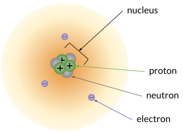

# Introduction

## Safety First

### Safety Contract

- [English](./public/StudentSafetyContract-En.pdf)
- [Spanish](./public/StudentSafetyContract-Sp.pdf)

## What is Chemistry?

### the central science

### What do chemists study?

# Atoms, isotopes, and ion

Atoms are made of three [subatomic particle]s: [proton]s and [neutron]s in the [nucleus] and [electron] "orbiting" the nucleus.

# Atomic models and periodicity

# Chemical bonding

# Chemical reactions

# Stoichiometry and the mole

# States of matter

# Thermochemistry

# Solutions, acids, and bases

# Reaction rates and equilibrium

# Nuclear chemistry

[subatomic particle]:https://en.wikipedia.org/wiki/subatomic_particle
[electron]:https://en.wikipedia.org/wiki/electron
[proton]:https://en.wikipedia.org/wiki/proton
[neutron]:https://en.wikipedia.org/wiki/neutron
[nucleus]:https://en.wikipedia.org/wiki/atomic_nucleus
[Nuclear Fusion]: https://en.wikipedia.org/wiki/Nuclear_fusion
[Nuclear Fission]:https://en.wikipedia.org/wiki/Nuclear_fission
[Radioactive Decay]: https://en.wikipedia.org/wiki/Radioactive_decay
[Radioactive Isotope]: https://en.wikipedia.org/wiki/Radionuclide
[Radiation]: https://en.wikipedia.org/wiki/Radiation