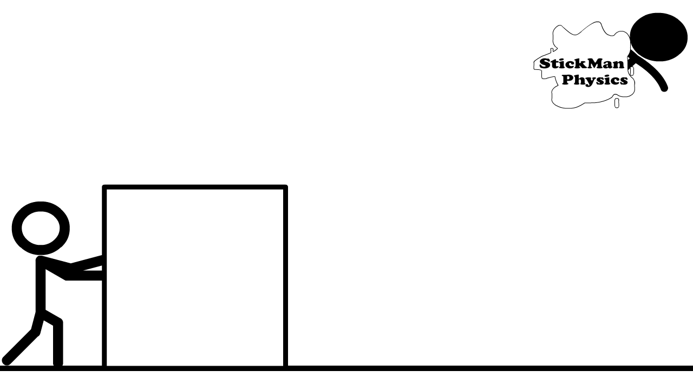

## Unit 1
### Properties of Matter
### (Propiedades de la Materia)

### 1.1 Composition of Matter

Matter is made of atoms that cannot be broken apart.<!-- .element: class="fragment" data-fragment-index="1" -->
Atoms are mostly empty space, but inside atoms there are three kinds of particles:
Protons and neutrons are in the nucleus of the atom.
Electrons are outside the nucleus.

#### Mass and Electric Charge

The mass of an atom is almost all in the protons and neutrons in the nucleus.
Electrons have a very small mass.
The unit of mass is the kilogram.
Protons have a positive electric charge and electrons have a negative electric charge.
Neutrons have a neutral charge.

#### Molecules

Two or more atoms attached together are a molecule.
The connections between atoms in a molecule are called chemical bonds.
Example – a molecule of water (H2O) has two hydrogen atoms and one oxygen atom.

#### Measuring Matter

The dimensions of matter are described as  length.
The unit of length is the meter (m).
The flat surfaces of matter are described as surface area.
The unit of surface area is meter squared (m2)
The space matter occupies is described by its volume.
The unit of volume is meter cubed (m3).

#### Unit Conversions

1 meter (m) = 100 centimeters (cm)
1 centimeter (cm) = 10 millimeters (mm)
1 meter (m) = 1000 millimeters (mm)
1 kilometer (km) = 1000 meters (m)

1 meter cubed (m3) = 1000 liters (L)
1 liter (L) = 1,000 centimeters cubed (cm3)
1 centimeter cubed (cm3) = 1 milliliter (mL)
1 liter (L) = 1000 milliliters (mL) 

### 1.2 Volume, Mass, and Density

The density of a material is defined as:

$$ density = \frac{mass}{volume}$$

If the density of a substance is less than the density of a liquid, the substance will float on the liquid.
If the density of a substance is greater than the density of a liquid, the substance will sink in the liquid.

### 1.3 Forces on Matter

A force is a push 

or a pull on an object.

We draw a force with an arrow that shows the direction of the force.

There are two kinds of forces:
Gravitational forces
Electromagnetic forces

#### Gravitational Force

Gravity is a force on the mass of an object caused by the mass of another object.
Gravity is always a pulling force between two masses.
The gravitational force between two masses happens no matter how far away the masses are from each other.
The gravitational force gets smaller when the masses get farther apart.
On Earth the gravitational force on objects is always downward.

#### Electromagnetic Force

The electromagnetic force is caused by the pushing and pulling between the electric charges of protons and electrons in an object no matter how far apart they are.
The electromagnetic force gets smaller when the electric charges are get farther apart.
Two positive charges (protons) will push (repel) each other away.
Two negative charges (electrons) will push (repel) each other away.
A positive charge (proton) and a negative charge (electron) will pull (attract) each other.

#### Examples of Electromagnetic Force

Positive electric charges (protons) in a metal can pull on (attract) negative electric charges (electrons) in a balloon.
The positive (protons) and negative (electrons) electric charges in a magnet can either push the magnets apart (repel) or pull them together (attract).
The negative electric charges (electrons) in your hand push on the negative electric charges (electrons) in an object that you touch.
When you stretch a rubber band the protons attract the electrons and pull back.