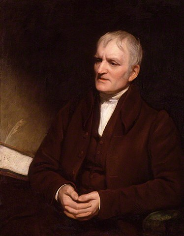
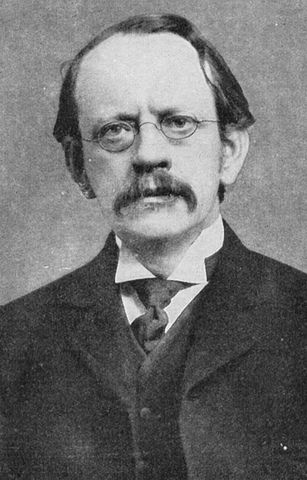
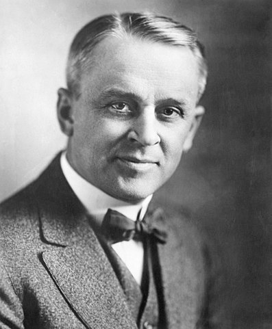
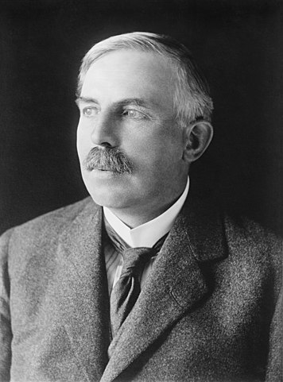

# Atomic Theory

## John Dalton

Father of Atomic theory

## Dalton's Atomic Theory
- elements are made of atoms <!-- .element: class="fragment" data-fragment-index="1" -->
- atoms of the same element are identical, but different from atoms of other elements <!-- .element: class="fragment" data-fragment-index="2" -->
- atoms of elements cannot be created, divided, or destroyed through chemical means <!-- .element: class="fragment" data-fragment-index="3" -->
- atoms combine in whole number ratios to form compounds <!-- .element: class="fragment" data-fragment-index="4" -->

Note: This will only appear in the speaker notes window.

## J. J. Thompson

Discovered the electron

## Millikan

Measured the charge of the electron

## Rutherford

Discovered the nucleus

## External 3.2

Content 3.2

## External 3.3 (Image)

## External 3.4 (Math)

`\[ J(\theta_0,\theta_1) = \sum_{i=0} \]`
